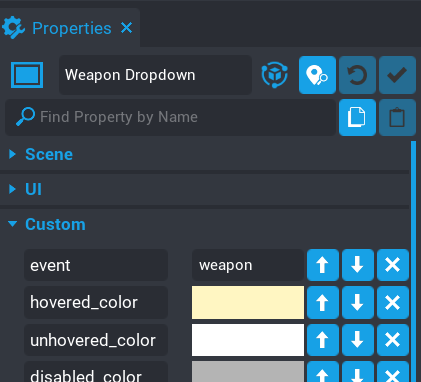

# Events

The `UI Dropdown` component has a simple event system using [broadcasts](https://docs.coregames.com/core_api/#events).

If you have set the `event` property then your event call will be made up with the name of your event you picked.  

Any custom event should be unique for each dropdown.

So for example if you have a Weapons Dropdown and you set the `event` property to `weapons`, then your event will be like so.

```lua
Events.Connect("on_weapons_selected", function(index, option, value))
Events.Connect("on_weapons_focused", function())
Events.Broadcast("on_weapons_enable")
Events.Broadcast("on_weapons_disable")
```



Otherwise if you don't set an event, then they will be called using `dropdown` instead.

```lua
Events.Connect("on_dropdown_selected", function(index, option, value))
Events.Connect("on_dropdown_focused", function())
Events.Broadcast("on_dropdown_enable")
Events.Broadcast("on_dropdown_disable")
```

Here are a list of the events are what they do.

| Default Event Name | Return Type | Description |
| ------------------ | ----------- | ----------- |
| `on_dropdown_selected` | Event&lt;index, UIButton, value&gt; | Fires when an option in the dropdown has been selected.  The `value` is the option property setup by you or it is `nil`.|
| `on_dropdown_focused` | None | Fires when an the drop down is clicked on.  Handy if you need to bring the drop down to the front of your UI when the player clicks on it. |

| Default Event Name | Parameters | Description |
| ------------------ | ---------- | ----------- |
| `on_dropdown_enable` | None | The component listens for this event and enables the drop down. |
| `on_dropdown_disable` | boolean | The component listens for this event and disables the drop down.  You can pass in a boolean value if you want the dropdown selected option to be cleared.  Default is `false`. |
