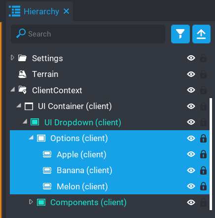
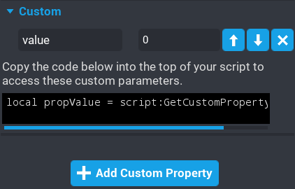

# Options

Creating options is really simple.  

1. Deinstance the `UI Dropdown` component in your hierarchy.
2. Expand the `Options` folder inside the `UI Dropdown` component.
3. Create your options here.

All the colors and positions are setup automatically by the component.  This makes things really easy and fast for you.

## Options Value Property

Sometimes you may need to store a value for an option.  This is handy when you use the events and want to grab the value for the option selected.  This is made easy by simply creating a custom property called `value` that will be grabbed and passed to the event handler for you to use.

Simply add a custom property to your option.  The type can be whatever you want.

For example you might have a Weapons dropdown and the option names are made up of weapon names and you might want those to relate to an id.  So you can setup a value property with the id of the weapon.

