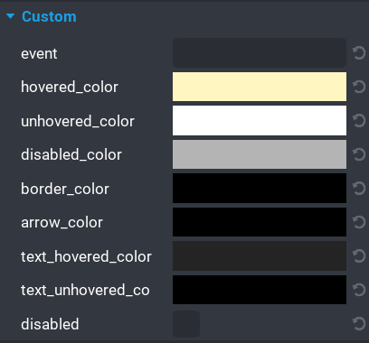

# Properties

The `UI Dropdown` component comes with quite a few properties that allow for easy customisation.

| Property Name | Description |
| ------------- | ----------- |
| `event` | A unique event can be set for broadcasting and listening.  See the [Events](/events) section for more information. |
| `hovered_color ` | The color of the dropdown and its options when the mouse is hovered over them. |
| `unhovered_color` | The color of the dropdown and its options when the mouse moves off them.  This is the default color. |
| `disabled_color` | The color of the dropdown when it is disabled. |
| `border_color` | The color of the border around the dropdown and options panel. |
| `arrow_color` | The color of the arrow in the dropdown. |
| `text_hovered_color` | The color of the dropdown and options text when the mouse is hovered over them. |
| `text_unhovered_color` | The color of the dropdown and its options when the mouse moves off them.  This is the default color. |
| `disabled` | _(boolean)_ If enabled then the dropdown will be disabled at runtime. |